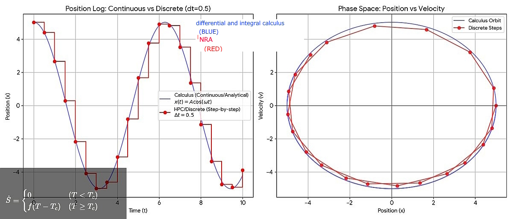

# Intensional Dynamics Engine (IDE) / HAN Project
### Based on Nomological Ring Axioms (NRA)

[](LICENSE)
[]()
[]()

---

## 1. Overview: From Macro-Approximation to Micro-Reality

This project introduces the **Intensional Dynamics Engine (IDE)**, codenamed **HAN**. It is a theoretical and computational framework that reinterprets physical reality not as a continuous space, but as a discrete, topological process driven by information gradients.

### The Two Layers of Truth

| Layer | Name | Characteristics |
|-------|------|-----------------|
| **Blue** | Macro-Approximation | Calculus, continuous, "Shadow" (Projected Reality) |
| **Red** | Micro-Reality | Discrete, stick-slip dynamics, entropy export |

> **Note to Researchers:** This repository serves as **Prior Art** for the concepts of "Intensional Information Gradient Dynamics" and "Causal Diode Architecture" in AI.

---

## 2. Visual Proof of Concept

### A. The Phenomenal Projection (Live Visualization)

This real-time visualization demonstrates the **Dissipative Structure** of the engine. The system maintains **Dynamic Equilibrium (Homeostasis)** through entropy export (σ - J).


*Figure 1: Real-time phase progression and fluctuation monitoring. The system demonstrates self-organization through dissipative processes.*

### B. Discrete Reality vs. Calculus Illusion

The core discovery: The physical world is not inherently continuous (Blue line), but discrete (Red steps). Movement only occurs when Tension exceeds the Threshold (Tc).



*Figure 2: Comparison between the analytical illusion of Calculus (Blue) and the discrete reality of the HAN core (Red). The Red line "locks" until energy accumulates.*

### C. The Core Equation (Step Function)

Unlike differential equations that assume continuous change, the state transition Ṡ in HAN is defined by a threshold-based step function:

```
Ṡ = { 0           (T < Tc)
    { f(T - Tc)   (T ≥ Tc)
```

---

## 3. Core Innovations (Novelty Claims)

| Innovation | Description |
|------------|-------------|
| **Intensional Dynamics** | Spatial variables (x, y, z) prohibited in causal core. Driven solely by Δ_info |
| **Causal Diode** | Distance is Output (Effect), never Input (Cause). Π⁻¹ forbidden |
| **Discrete Phase Locking** | Residuals discarded to Effect layer as "Heat/Log" |
| **Homeostasis** | Stable state = Dynamic equilibrium (ω > 0, Work > 0), not cessation |

---

## 4. Directory Structure

```
/src
  ├── HannyaPhysicsCore_v3_4.ts      # Physics engine (TypeScript)
  └── Ritsukan_Spiral_Dissipative_v1_4.html  # Visualization tool

/docs/axioms
  ├── Hannya_Fundamental_Law_v3_3.md  # Supreme law (L∧P∧C∧D)
  └── HannyaEngine_RootDefinition_v2_3.md  # Axiomatic definitions

/docs/logic
  ├── Rationale_for_Residual_Discarding.md
  └── Discrete_Reality_Interpretation.md

/docs/validation
  └── Integrated_Validation_Checklist_v1_1.md
```

---

## 5. Usage

1. Download `Ritsukan_Spiral_Dissipative_v1_4.html`
2. Open in any modern web browser
3. Observe: phase progression, entropy generation (σ), fluctuation dynamics

---

## 6. Contact

- **Technical Issues / Questions:** Please open a [GitHub Issue](../../issues) with tag `[Inquiry]`
- **Academic Collaboration:** tokuni.m [at] gmail.com

---

## 7. License & Disclaimer

**License:** MIT License

**Disclaimer:** This software is provided "as is". The concepts presented herein are formalized for computational physics and information theory purposes.

---

*Copyright (c) 2025 M.Tokuni*

---
---

# 日本語版 / Japanese

## 1. 概要：マクロ近似からミクロ実体へ

本プロジェクトは **内包的動力学エンジン (IDE)**、開発コード名 **HAN** を提案します。物理的実体を連続空間ではなく、情報勾配によって駆動される離散的・位相的プロセスとして再解釈する理論・計算フレームワークです。

### 二層構造の真実

| 層 | 名称 | 特徴 |
|----|------|------|
| **青** | マクロ近似 | 微積分、連続、「影」（射影された現実） |
| **赤** | ミクロ実体 | 離散、スティック・スリップ動力学、エントロピー排出 |

> **研究者向け注記:** 本リポジトリは「内包的情報勾配動力学」および「因果ダイオード・アーキテクチャ」の **Prior Art（先行技術）** として機能します。

---

## 2. 視覚的概念実証

### A. 現象射影（リアルタイム可視化）

散逸構造を示すリアルタイム可視化です。エントロピー排出（σ - J）を通じて**動的平衡（ホメオスタシス）**を維持します。


*図1: 位相進行とゆらぎ監視のリアルタイム表示。散逸過程による自己組織化を実証。*

### B. 離散的実体 vs 微積分の幻想

核心的発見：物理世界は本質的に連続（青線）ではなく、離散（赤階段）です。張力が閾値(Tc)を超えた時のみ移動が発生します。


*図2: 微積分の解析的幻想（青）とHANコアの離散的実体（赤）の比較。赤線はエネルギーが蓄積するまで「ロック」する。*

### C. 核心方程式（ステップ関数）

連続変化を仮定する微分方程式と異なり、HANの状態遷移 Ṡ は閾値ベースのステップ関数で定義されます：

```
Ṡ = { 0           (T < Tc)   ← 閾値未満：変化なし
    { f(T - Tc)   (T ≥ Tc)   ← 閾値以上：遷移発生
```

---

## 3. 核心的革新（新規性主張）

| 革新 | 説明 |
|------|------|
| **内包的動力学** | 空間変数(x,y,z)を因果コアで禁止。Δ_infoのみで駆動 |
| **因果ダイオード** | 距離は出力(Effect)のみ、入力(Cause)禁止。Π⁻¹禁止 |
| **離散位相ロック** | 残差はEffect層へ「熱/ログ」として廃棄 |
| **恒常性** | 安定状態＝動的平衡(ω>0, Work>0)、停止ではない |

---

## 4. 使用方法

1. `Ritsukan_Spiral_Dissipative_v1_4.html` をダウンロード
2. 任意のモダンブラウザで開く
3. 位相進行、エントロピー生成(σ)、ゆらぎ動態を観察

---

## 5. 連絡先

- **技術的質問:** [GitHub Issue](../../issues) を `[Inquiry]` タグ付きで作成してください
- **学術連携:** mtookuni39 [at] gmail.com

---

## 6. ライセンス

**ライセンス:** MIT License

**免責事項:** 本ソフトウェアは「現状のまま」提供されます。本書で提示される概念は、計算物理学および情報理論の目的で形式化されています。

---

*Copyright (c) 2025 M.Tokuni*
